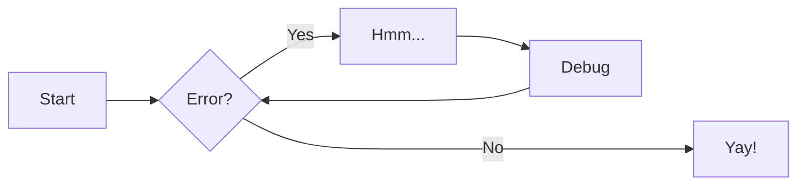

# Examples

## Shell

```shell
$ echo $EDITOR
vim
$ git checkout main
Switched to branch 'main'
Your branch is up-to-date with 'origin/main'.
$ git push
Everything up-to-date
$ echo 'All
> done!'
All
done!
```

```py linenums="1"
def main():
  pass
```

## Graphs



## Maths

$$
\operatorname{ker} f=\{g\in G:f(g)=e_{H}\}{\mbox{.}}
$$

$$
E(\mathbf{v}, \mathbf{h}) = -\sum_{i,j}w_{ij}v_i h_j - \sum_i b_i v_i - \sum_j c_j h_j
$$

\[3 < 4\]

\begin{align}
p(v*i=1|\mathbf{h}) & = \sigma\left(\sum_j w*{ij}h*j + b_i\right) \\
p(h_j=1|\mathbf{v}) & = \sigma\left(\sum_i w*{ij}v_i + c_j\right)
\end{align}
